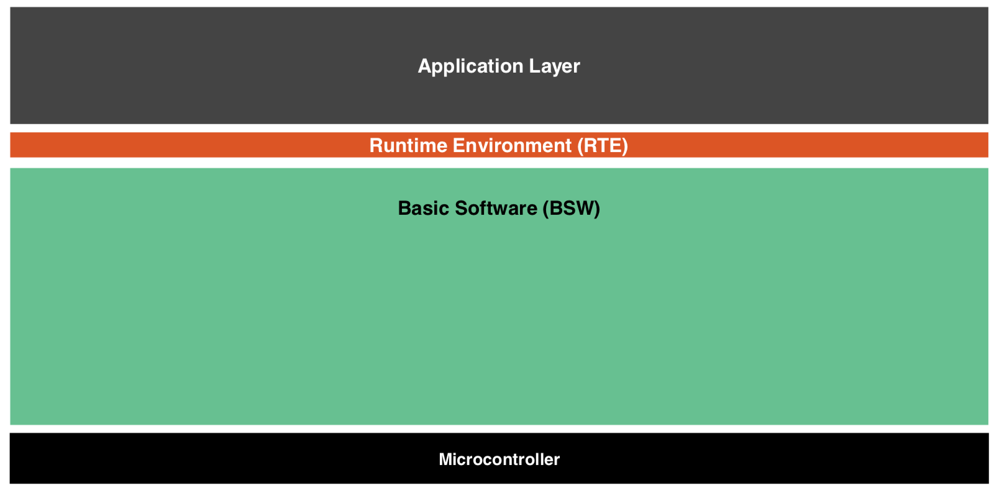
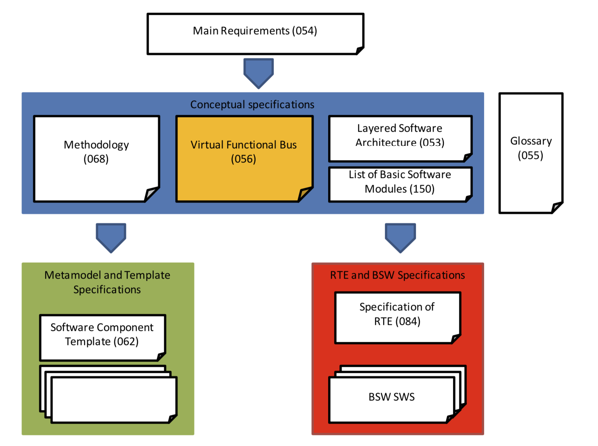

repository for capstone design

# Topics

## Introduction

## The SW life cycle and the V model

## Automotive SPICE 
* Automotive SPICE 3.1 ([English](http://www.automotivespice.com/fileadmin/software-download/AutomotiveSPICE_PAM_31.pdf), [Korean](http://www.automotivespice.com/fileadmin/software-download/AutomotiveSPICE_PAM_31_Korean.pdf))

## Functional Safety and ISO 26262

## AUTOSAR (AUTomotive Open System ARchitecture)
 
 * https://www.autosar.org
 * classic vs. adaptive platform
 * key documents to read (version 4.3.1)

| title (link)        | ID           |
| ------------- |:-------------:|
| [Virtual Functional Bus](https://www.autosar.org/fileadmin/user_upload/standards/classic/4-3/AUTOSAR_EXP_VFB.pdf) | 056  |
| [Layered Software Architecture](https://www.autosar.org/fileadmin/user_upload/standards/classic/4-3/AUTOSAR_EXP_LayeredSoftwareArchitecture.pdf)      | 053     |
| [List of Basic Software Modules](https://www.autosar.org/fileadmin/user_upload/standards/classic/4-3/AUTOSAR_TR_BSWModuleList.pdf) | 150 |
| [Methodology](https://www.autosar.org/fileadmin/user_upload/standards/classic/4-3/AUTOSAR_TR_Methodology.pdf) | 068 |
| [Glossary](https://www.autosar.org/fileadmin/user_upload/standards/foundation/1-3/AUTOSAR_TR_Glossary.pdf) | 055 |
| [Main Requirements](https://www.autosar.org/fileadmin/user_upload/standards/foundation/1-3/AUTOSAR_RS_Main.pdf) | 054| 
| [Generic Structure Template](https://www.autosar.org/fileadmin/user_upload/standards/classic/4-3/AUTOSAR_TPS_GenericStructureTemplate.pdf) | 202 |
| [Software Component Template](https://www.autosar.org/fileadmin/user_upload/standards/classic/4-3/AUTOSAR_TPS_SoftwareComponentTemplate.pdf) | 062| 
| [Specification of RTE Software](https://www.autosar.org/fileadmin/user_upload/standards/classic/4-3/AUTOSAR_SWS_RTE.pdf) | 084 |

 

## Automotive SW Testing

# Examples
## PID controller
* https://en.wikipedia.org/wiki/PID_controller

## ABS (Anti-lock Braking System)
* https://en.wikipedia.org/wiki/Anti-lock_braking_system
* [video](https://youtu.be/ru4JIZ-x8yo)

## Airbag
* https://en.wikipedia.org/wiki/Airbag

## ACC (Adaptive Cruise Control)
* https://en.wikipedia.org/wiki/Adaptive_cruise_control

## ADAS (Advanced Driver-Assistance System)
* https://en.wikipedia.org/wiki/Advanced_driver-assistance_systems
* https://en.wikipedia.org/wiki/Mobileye
* https://en.wikipedia.org/wiki/Tesla_Autopilot
* http://www.ti.com/applications/automotive/adas/overview.html

## Autonomous car
* https://en.wikipedia.org/wiki/Autonomous_car
* https://www.naverlabs.com/storyDetail/16
* https://www.dspace.com/shared/data/pdf/2014/30_33_Auto.pdf

# What's next?
* [Speech-Based Productivity Support in the Car](https://www.microsoft.com/en-us/research/publication/an-exploration-of-speech-based-productivity-support-in-the-car/)
* [Using Time and Space Efficiently in Driverless Cars](https://dl.acm.org/citation.cfm?id=3300635)
* [How to Work in the Car of the Future?](https://dl.acm.org/citation.cfm?id=3300284)
