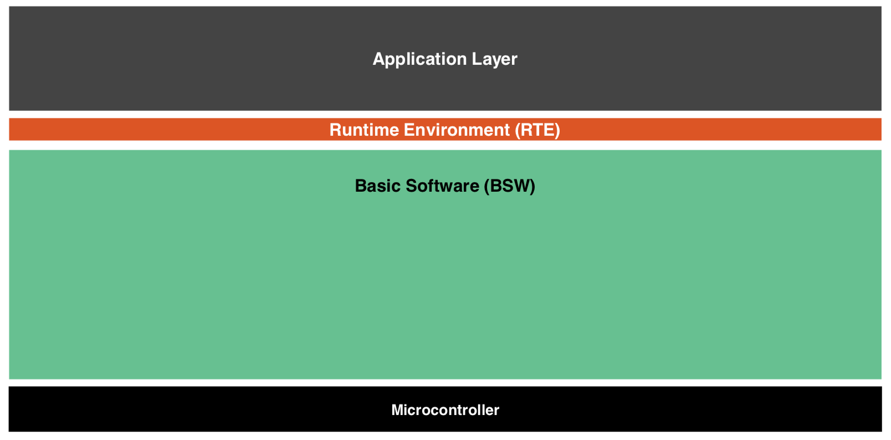

### AUTOSAR (AUTomotive Open System ARchitecture)

* https://www.autosar.org
* https://www.autosar.org/nc/document-search/
* classic vs. adaptive platform
* key documents to read (version 4.3.1)

| title (link)        | ID           |
| ------------- |:-------------:|
| [Virtual Functional Bus](https://www.autosar.org/fileadmin/user_upload/standards/classic/4-3/AUTOSAR_EXP_VFB.pdf) | 056  |
| [Layered Software Architecture](https://www.autosar.org/fileadmin/user_upload/standards/classic/4-3/AUTOSAR_EXP_LayeredSoftwareArchitecture.pdf)      | 053     |
| [List of Basic Software Modules](https://www.autosar.org/fileadmin/user_upload/standards/classic/4-3/AUTOSAR_TR_BSWModuleList.pdf) | 150 |
| [Methodology](https://www.autosar.org/fileadmin/user_upload/standards/classic/4-3/AUTOSAR_TR_Methodology.pdf) | 068 |
| [Glossary](https://www.autosar.org/fileadmin/user_upload/standards/foundation/1-3/AUTOSAR_TR_Glossary.pdf) | 055 |
| [Main Requirements](https://www.autosar.org/fileadmin/user_upload/standards/foundation/1-3/AUTOSAR_RS_Main.pdf) | 054| 
| [Generic Structure Template](https://www.autosar.org/fileadmin/user_upload/standards/classic/4-3/AUTOSAR_TPS_GenericStructureTemplate.pdf) | 202 |
| [Software Component Template](https://www.autosar.org/fileadmin/user_upload/standards/classic/4-3/AUTOSAR_TPS_SoftwareComponentTemplate.pdf) | 062| 

